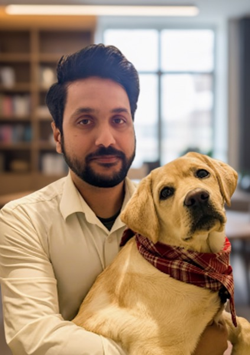

# Akash Srivastava

I am the Director and Chief Architect of Core AI at IBM, where I lead [**AgentOps**](https://newsroom.ibm.com/2025-10-07-2025-ibm-and-anthropic-partner-to-advance-enterprise-software-development-with-proven-security-and-governance)—a platform for building, evaluating, and optimizing agentic AI systems.

I am a Principal Investigator at the [MIT-IBM Watson AI Lab](https://mitibmwatsonailab.mit.edu/), where I led the post-training team for [Granite](https://www.ibm.com/granite). I also founded the **[Red Hat AI](https://www.redhat.com/en/artificial-intelligence) [Innovation Team](https://ai-innovation.team/)** (now in advisory role), where we created [**InstructLab**](https://instructlab.ai/)—an open-source framework for LLM customization.

I obtained my PhD at the University of Edinburgh, where I worked with [Prof Charles Sutton](https://homepages.inf.ed.ac.uk/csutton/) and [Prof Michael U. Gutmann](https://michaelgutmann.github.io/) on [variational inference and generative models](https://scholar.google.com/citations?view_op=view_citation&hl=en&user=2h6SZeEAAAAJ&cstart=20&pagesize=80&citation_for_view=2h6SZeEAAAAJ:Tiz5es2fbqcC).

---

## Research

My research interests include **agentic AI systems**, **inference-time scaling and reasoning**, **post-training and model customization**, and **generative modeling**.

---

## Selected Press

- **[A smarter way for large language models to think about hard problems](https://news.mit.edu/2025/smarter-way-large-language-models-think-about-hard-problems-1204)** — *MIT News, December 2025*
- **[AI DIY: How research is making custom language models work with more of us](https://research.redhat.com/blog/article/ai-diy-how-research-is-making-custom-language-models-work-with-more-of-us/)** — *Red Hat Research Quarterly, Spring 2025*
- **[Beyond tokens per second: Unlocking smarter enterprise AI with inference-time scaling](https://www.redhat.com/en/blog/smarter-enterprise-ai-inference-time-scaling)** — *Red Hat Blog, May 2025*
- **[HW and SW Architecture Approaches For Running AI Models](https://semiengineering.com/hw-and-sw-architecture-approaches-for-running-ai-models/)** — *Semiconductor Engineering, 2024*
- **[How synthetic data could mitigate privacy and bias issues](https://www.thedrum.com/news/2023/05/08/how-synthetic-data-could-mitigate-privacy-and-bias-issues-marketers-using-ai)** — *The Drum, May 2023*
- **[To excel at engineering design, generative AI must learn to innovate](https://news.mit.edu/2023/generative-ai-must-innovate-engineering-design-1019)** — *MIT News, October 2023*

[All media coverage](/media/)

---

<h2 id="publications">Publications</h2>

<h3>Inference-Time Scaling, Sampling, & Probabilistic Inference (LLMs)</h3>









<h3>Alignment, Preference Learning, & Human Feedback</h3>









<h3>Model Merging, Fine-Tuning, & Parameter Efficiency</h3>











<h3>Diffusion Models & Generative Modeling</h3>

{% include pub-row.html
  image="/publications/thumbs/zhang2025soda.png"
  title="SODA: Spectral Orthogonal Decomposition Adaptation for Diffusion Models"
  authors="Xinxi Zhang, Song Wen, Ligong Han, Felix Juefei-Xu, <strong>Akash Srivastava</strong>, Junzhou Huang, Vladimir Pavlovic, Hao Wang, Molei Tao, Dimitris Metaxas"
  venue="WACV"
  year="2025"
  paper_url="https://openaccess.thecvf.com/content/WACV2025/papers/Zhang_SODA_Spectral_Orthogonal_Decomposition_Adaptation_for_Diffusion_Models_WACV_2025_paper.pdf"
  bibtex_id="zhang2025soda"
%}





<h3>Synthetic Data, Privacy, & Density Ratio Estimation</h3>









<h3>Red-Teaming, Robustness, & Evaluation</h3>







<h3>Foundation Models for Planning, Design, & Systems</h3>







<h3>Lifelong Learning, Program Synthesis, & Modularity</h3>







<h3>Core Generative Modeling & Bayesian ML</h3>









<h3>Applied / Cross-Domain Modeling</h3>





*For complete citation information and PDFs, visit my [Google Scholar profile](https://scholar.google.com/citations?user=2h6SZeEAAAAJ&hl=en).*
