# SimGAN
Based on the discussion with Josh yesterday I have adapted the current model to account for identity (shape), pose and color.
This is leaves lighting, which is now exaplained by the noise vector.

## First 5 principal components of the shape (for fixed pose and color)
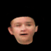

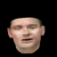
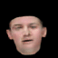
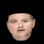

## Pose Variations (for fixed shape and color)
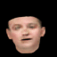
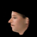
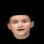

## Color Variation (For the first principal direction of color) 
#### Varying color for fixed shape and pose
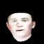 
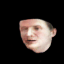 
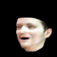
### Varying pose and color together
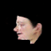 
### Varying shape and color together 
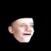 

